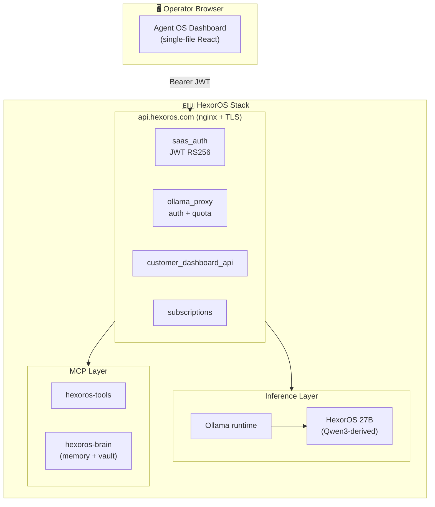

# Architecture

HexorOS Agent OS Dashboard is the **operator surface** of the broader HexorOS
sovereign AI stack. This document explains where the dashboard sits in the
stack and which boundaries it respects.

## System Overview



## What the Dashboard Does

The dashboard is a **stateless** operator UI. All state lives either in the
browser (`localStorage` for non-secret config) or in the HexorOS backend.

| Panel | Backend Endpoint | Purpose |
|---|---|---|
| Dashboard | `/api/dashboard/*` | Live agent status, token usage, queue depth |
| Agents | `/api/chat/*` (streaming) | Send a message, watch token-by-token reply |
| Vault | `/mcp/brain/*` (planned) | Browse notes, link agent context to documents |
| Mindmap | (derived from registry) | Graph view of agents and infra nodes |
| Settings | `localStorage` | Per-agent model, system prompt, API host |

## Boundaries

The dashboard **never**:

- Stores secrets at rest beyond `localStorage` on the operator's own machine
- Calls third-party inference providers directly — every request flows through
  `api.hexoros.com` so quota, auth, and EU-residency are enforced server-side
- Touches infrastructure (`nginx`, `systemd`, `letsencrypt`) — that surface is
  reserved for the backend operator role
- Persists vault notes on its own — the dashboard reads the MCP brain service;
  writes always round-trip through MCP for audit

## File Layout

```
.
├── index.html          # single-file React app, Babel-in-browser
├── README.md           # overview + quick start
├── ARCHITECTURE.md     # this file
├── ROADMAP.md          # public roadmap, mirrors Indiegogo stretch goals
├── CHANGELOG.md        # versioned change log
├── docs/
│   ├── SETUP.md        # how to point the dashboard at your HexorOS install
│   └── CUSTOMIZATION.md # how to add your own agents, panels, vault sources
├── examples/
│   ├── agent.json      # example per-agent config
│   └── vault-note.md   # example vault note shape
├── screenshots/        # marketing + docs screenshots
└── .github/workflows/
    └── pages.yml       # auto-deploy to GitHub Pages on push to main
```

## Why Single-File HTML

Three reasons:

1. **Audit-able by anyone.** A backer or new operator can read the entire UI
   without a build step, package manager, or transpiler. `view-source:` is the
   whole story.
2. **Zero deploy ceremony.** Drop `index.html` on any static host — S3, a USB
   stick, GitHub Pages, your own nginx — and it runs.
3. **Resilient to supply-chain attacks.** No `node_modules`, no lockfile drift,
   no left-pad incident. The React + Babel dependencies are pinned CDN URLs.

A future v2 may introduce a Vite build for tree-shaking and proper TypeScript.
The single-file form will remain available as a reference build.

## Relation to the HexorOS Engine

This repo ships the **dashboard only**. The HexorOS Engine (inference proxy,
auth, MCP servers, model) is a separate, hosted product available in three
tiers — see [hexoros.com](https://hexoros.com).

The dashboard works against any HexorOS Engine instance: your own
self-hosted install, the shared EU GPU tier, or a dedicated Enterprise
deployment.
