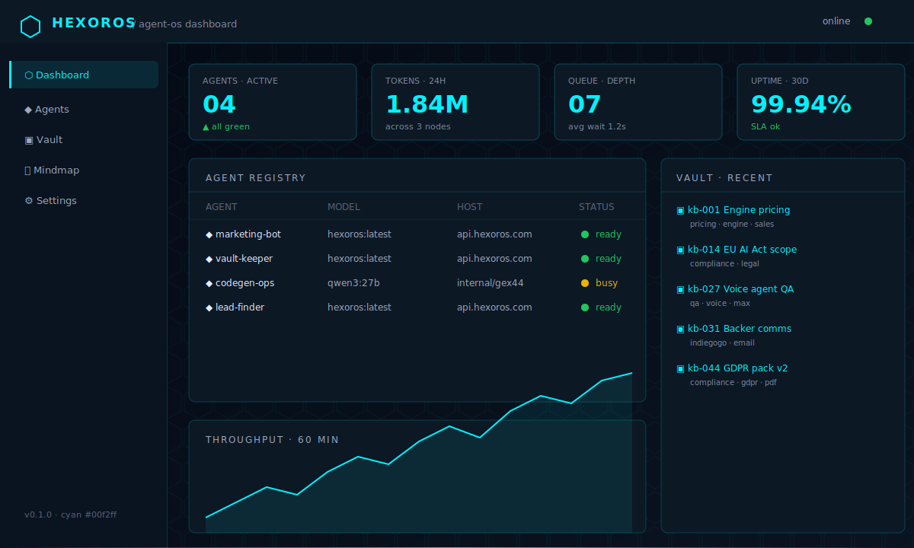

# HexorOS — Agent OS Dashboard

[](https://hexoros.github.io/hexoros-agent-os/)
[](https://hexoros.com)
[](https://hexoros.com)

The operator surface for self-hosted AI agents.
Single-file React. Zero build step. Audit every line in your browser.



## Why this exists

Most AI tools sell you access — a chat box, a monthly bill, and your prompts
quietly become someone else's training data.

HexorOS is the sovereign alternative: a self-hosted AI operating system that
runs entirely on your hardware or on EU-resident GPU servers you control.
This repo ships the **operator dashboard** that sits in front of that stack.

## What you get

- 📊 **Live agent registry** — status, model, host, queue depth for every running agent
- 💬 **Streaming chat** — token-by-token replies, tool calls, sub-agent delegation
- 🗃️ **Vault browser** — read, link, and feed notes into agent context
- 🕸️ **Mindmap view** — graph of agents, infra nodes, and product surfaces
- ⚙️ **Per-agent settings** — model, system prompt, API endpoint, persisted in `localStorage`
- 🔐 **No secrets in the repo** — operator credentials live in the operator's browser only

## Quick start

```bash
git clone https://github.com/HexorOS/hexoros-agent-os.git
cd hexoros-agent-os
python3 -m http.server 8000
# open http://localhost:8000
```

Or just double-click `index.html`. Full instructions in [`docs/SETUP.md`](docs/SETUP.md).

## Repository layout

```
.
├── index.html          single-file React app (Babel-in-browser, no build step)
├── ARCHITECTURE.md     how this dashboard fits into the HexorOS stack
├── ROADMAP.md          public roadmap, mirrors the Indiegogo stretch goals
├── CHANGELOG.md        versioned change log
├── docs/
│   ├── SETUP.md        deploy locally, on GitHub Pages, or behind your own nginx
│   └── CUSTOMIZATION.md add agents, panels, theme colors, custom backends
├── examples/
│   ├── agent.json      example per-agent configuration
│   └── vault-note.md   example vault note shape
└── screenshots/        marketing + docs imagery
```

## Documentation

- [Architecture overview](ARCHITECTURE.md) — diagrams, boundaries, design rationale
- [Setup guide](docs/SETUP.md) — three modes of running the dashboard
- [Customization](docs/CUSTOMIZATION.md) — add your own agents, panels, themes
- [Roadmap](ROADMAP.md) — what ships next, what is funded by which milestone
- [Changelog](CHANGELOG.md) — every release, every breaking change

## Live demo

A public, read-only build of the latest `main` branch is auto-deployed to
GitHub Pages:

👉 **https://hexoros.github.io/hexoros-agent-os/**

The demo runs without a connected HexorOS Engine — chat calls return
`401 Unauthorized`, but every panel renders so you can audit the UI before
deciding to install.

## Project context

This dashboard is one component of the HexorOS sovereign AI stack:

- **HexorOS Engine** — inference proxy, auth, model serving (three commercial tiers)
- **HexorOS MCP layer** — tools and memory services for agents
- **Agent OS Dashboard** — *this repo*, the operator UI

The Engine and MCP layer are distributed separately. See [hexoros.com](https://hexoros.com)
for the full product matrix.

## Contributing

Issues and pull requests are welcome. The dashboard is intentionally small
and hackable — every panel can be added or replaced in `index.html` without
touching a build tool.

For larger changes that affect the public roadmap, open an issue first so we
can align on priorities. Backers of the HexorOS Indiegogo campaign get
prioritized review.

## Status

**v0.1.0 — public preview.** Production-ready for connecting to your own
HexorOS Engine instance. Multi-tenant hardening, mobile layout, and vault
write-back are tracked in [ROADMAP.md](ROADMAP.md).

---

Part of the **HexorOS** sovereign AI workforce — [hexoros.com](https://hexoros.com)
· 🇪🇺 EU-resident infrastructure · EN / DE / ES
